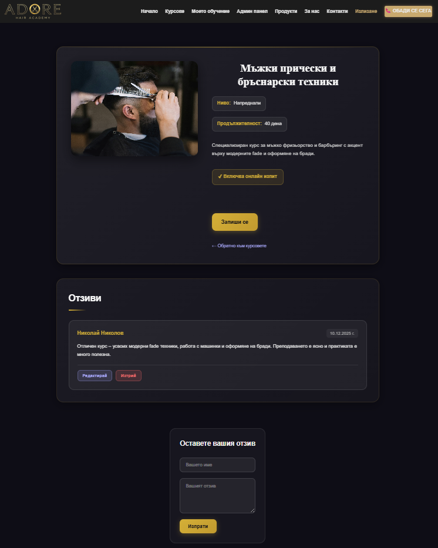
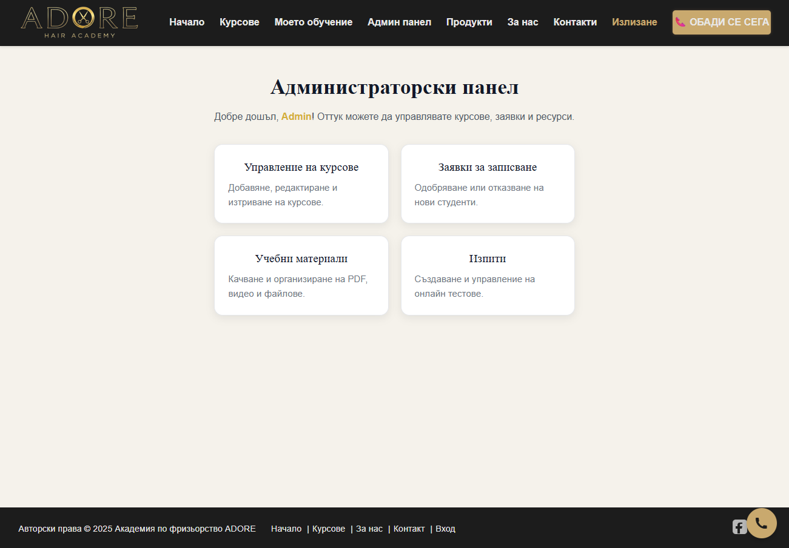
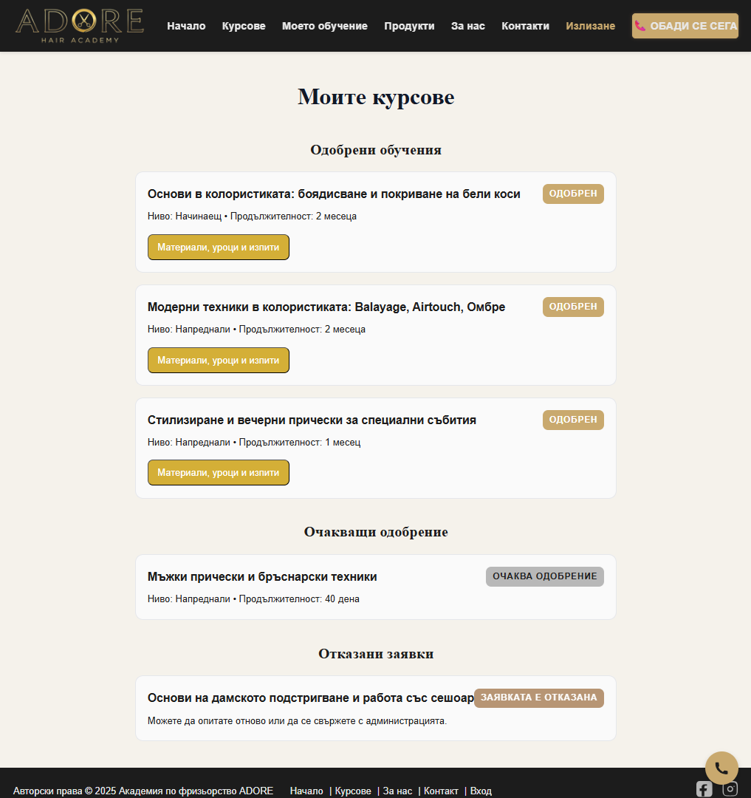
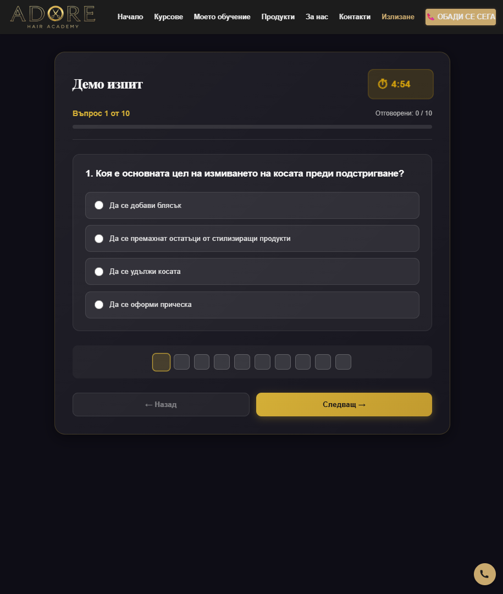
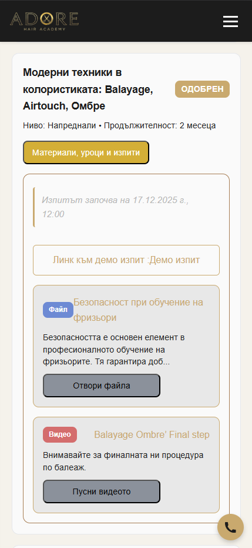

# Adore Hair Academy — React Application

A modern single-page application built with **React 19 + Vite**, designed for a real-world hairdressing academy.
The project includes authentication, admin panel, course management, review system, protected routes, global toast notifications, and a scalable architecture prepared for student dashboards and online exams.

This repository contains the frontend application in folder client, which communicates with a backend in folder server (SoftUni Practice Server Collections REST Service).


## Project Overview

**Adore Hair Academy** is a React project created as a web platform for a hairdressing academy.

### Main goals of the application:

- Present academy courses with detailed information
- User registration and login
- **Admin Panel** for courses, resources, enrollments and exams management (create, edit, delete)
- **Review System** - users can leave reviews for courses
- **Enrollment System** - user course enrollment
- **Student Dashboard** - exam system, and learning resources

## Live Demo

**Frontend:** [Deployed on Vercel](https://adore-hair-academy-site.vercel.app/) *(https://adore-hair-academy-site.vercel.app/)*

**Backend:** [Deployed on Render](https://adore-hair-academy-server.onrender.com/) *(https://adore-hair-academy-server.onrender.com/)*

### Test User Account
For testing user functionalities, use these credentials:

```
peter@abv.bg : 123456
george@abv.bg : 123456
```

### Test Admin Account

For testing admin functionalities, use these credentials:

```
admin@abv.bg: admin
```

admin dashboard route `/admin`

**Note:** This account has full admin privileges and can access the Admin Panel to create, edit, and delete courses.

---


## Features

### Authentication

- Register / Login / Logout for user authentication
- Token-based sessions stored in `localStorage`
- `AuthContext` + `useAuth` custom hook
- Auto-remove invalid tokens
- Route guards:
    - `ProtectedRoute` (for authenticated users)
    - `GuestRoute` (for guests)
    - `AdminRoute` (for admin)
- Admin role detection and authorization

### Routing

- React Router
- Redirect logic
- Custom guard flow

### Courses Module
- Public course listing (Beginner and Advanced )
- Course details page with full information

### Review Course
- Leave reviews for courses (authenticated users only)
- Edit your own reviews with modal dialog
- Delete reviews with confirmation
- Real-time validation

### Enrollment System
- Course enrollment form
- User data collection (name and phone number)
- Success/error toast notifications
- Form validation

### Admin Panel 
**Admin-only area**, accessible only to users with admin privileges
**Access:** Login with `admin@abv.bg` / `admin` to access the Admin Panel

### Custom Hooks Included
- `useAuth()` — authentication state management
- `useToast()` — global toast notification API
- `useAdminApi()` — admin API interactions
- `useCourseApi()` — course-related API calls
- `useFormAction()` — React 19 friendly form automation with `useActionState`
- `useLocalStorage()` — persistent state (planned for student dashboard)

### Global Toast System
Global toast notification system:
- `success` - green success messages
- `error` - red error messages
- `warning` - yellow warning messages
- Auto-hide after 4 seconds
- Can be called from anywhere using `useToast()`


## Installation and running the application

You will need Node.js installed. In a terminal run:

```
git clone https://github.com/Nikolay-S-Nikolov/adore-hair-academy-site
cd client
npm install
```

Run the client in development mode:

```
npm run dev
```

Navigate to the server directory and run the server
```
cd server
node server.js
```

## Upcoming Features

Planned improvements:

### Student Dashboard
- Progress indicators per course (percentage complete, lessons completed / total)
- Course syllabus and lesson plan with "Continue" buttons
- Calendar view with scheduled live sessions, deadlines and exam dates
- Final exam limited attempts and result recorded
- Exam attempts remaining and history
- Assignments submission and instructor feedback
- Certificates and downloadable completion badges
- Grades and performance history (exportable as PDF)
- Personal notes and saved bookmarks for lessons
- Notifications and messages from instructors
- Profile settings

### Online Exam Module
- Results history

### Staff Panel
- Statistics

## Bonuses

### External API Integration
- **Web3Forms API** - Handles contact form submissions and sends emails without backend server
- **Google Maps Embed API** - Interactive map showing academy location in Contact page
---

## Screenshots

### Home Page


### Courses Page


### Course Details with Reviews


### Admin Panel


### Student Dashboard


### Demo Exam


### Mobile View Student Dashboard with exams and resources


## Unit Testing

